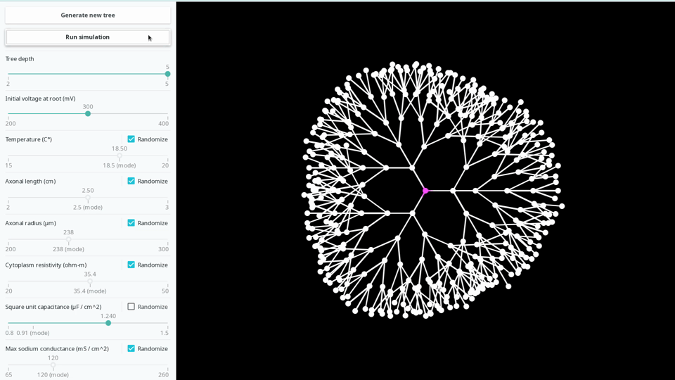

# neuronsim

This is a sim(ulation) of a biological neural network based on numeric solutions to the Hodgkin-Huxley equations.

It is based on chapters 2-4 and appendix B from the book [Neuroscience - A Mathematical Primer by Alwyn Scott](https://www.springer.com/gp/book/9780387954035).

## Installation

The easiest way to build the program is via [`dub`](https://dub.pm/). Either use `dub run neuronsim` to download and run the program or clone the repository and run `dub` inside.

## Notes

* The GUI itself is implemented using [GtkD](https://gtkd.org/). Because of this, the GUI code is somewhat object-oriented, but not quite because it is simply a layer in front of a non-object-oriented simulation.

* The naming is purposefully verbose so that the code is as clear as possible.

* Here are some highlights from the code:
  * All the parameter metadata is specified using user-defined annotations in the [ParameterSet](./source/neuronsim/sim/parameter_set.d) struct.
  * The equations are solved numerically in the [simulateImpulse](./source/neuronsim/sim/impulse_sim.d) function.
  * The [MutableSimWrapper](./source/neuronsim/sim/mutable_sim_wrapper.d) creates a mutable container for the otherwise immutable [SimConfig](./source/neuronsim/sim/sim_config.d) and [NeuralTreeSim](./source/neuronsim/sim/neural_tree_sim.d) classes. The latter two are immutable because they are shared between threads. The former is mutable because once a new tree is generated we need to somehow update its reference in the GUI code (so we update its wrapper's reference).
  * A separate thread is launched using the [SimGenerator](./source/neuronsim/sim/sim_generator.d) class for generating new neural trees without blocking the UI thread.
  * The tree painting happens in the [NeuralTreeCanvas](./source/neuronsim/gui/neural_tree_canvas.d) class.
